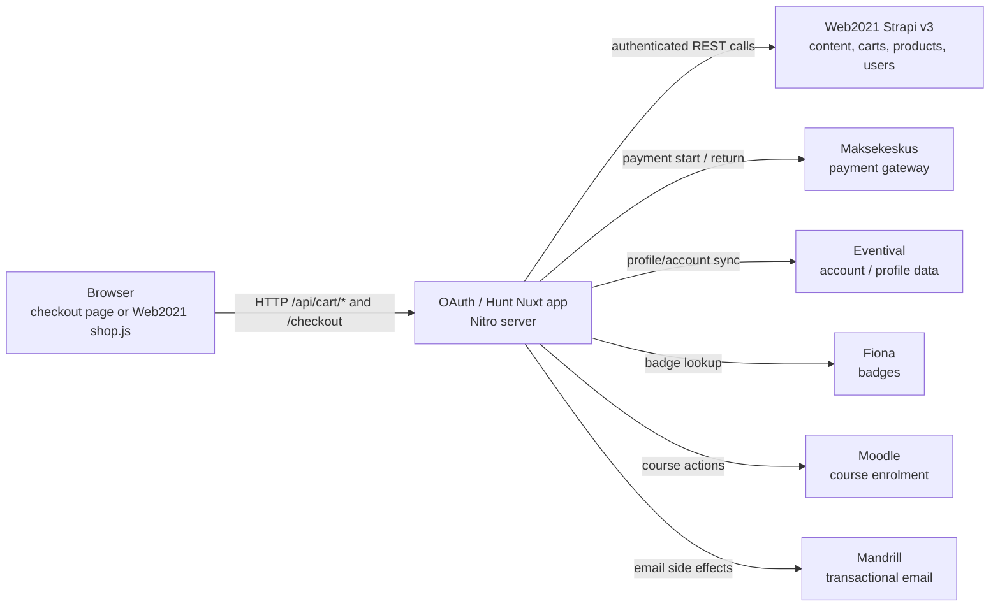
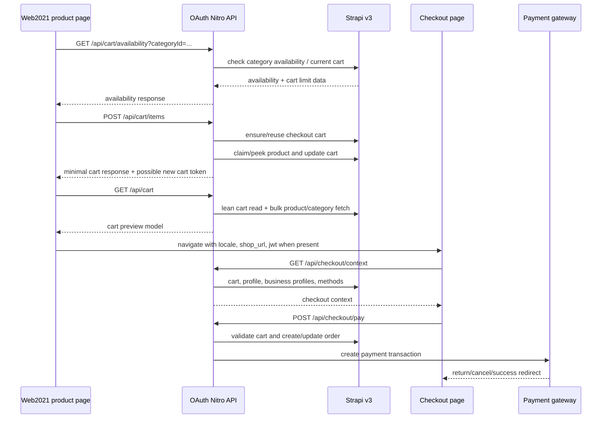
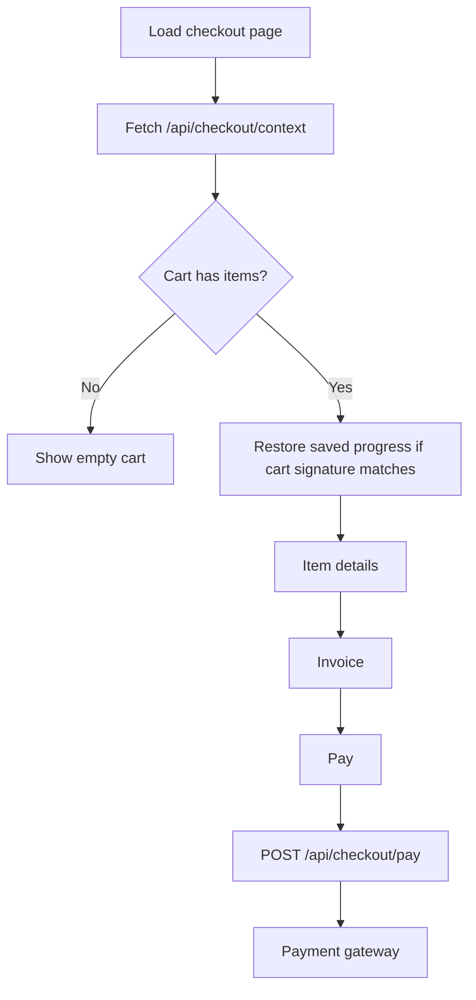
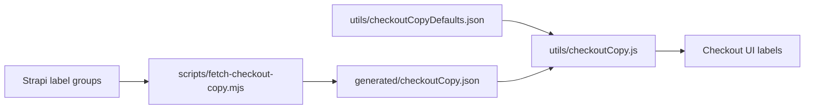

# OAuth Technical Overview

Last reviewed: 2026-07-01

## Scope

This repository is the Nuxt 3/Nitro application used for PÖFF account, OAuth, profile, and checkout flows. For the shop work, it acts as the browser-facing backend-for-frontend between Web2021 static shop pages and Strapi v3.

The application is not a static build like Web2021. It runs as a server process and handles runtime requests for cart mutation, checkout context, profile validation, payment creation, and guest-cart claim after login.

## Main Modules

| Area | Files | Responsibility |
| --- | --- | --- |
| Checkout UI | `pages/checkout/index.vue`, `pages/checkout/components/*`, `pages/checkout/composables/*` | Multi-step checkout, cart session display, invoice/profile/payment forms, progress persistence, photo persistence. |
| Cart API | `server/api/cart/*` | Thin Nitro handlers for cart context, add/remove/touch/clear/claim/availability. |
| Checkout API | `server/api/checkout/*` | Checkout context, owner validation, profile update, and payment start. |
| Strapi integration | `server/utils/strapi.js` | Central integration layer for Strapi auth, users, carts, products, orders, payment, guest claim, and external integrations. |
| Runtime resilience | `server/plugins/network-resilience.js`, `server/plugins/cleanup.js`, `server/middleware/cart-rate-limit.js` | HTTP resilience, expired-cart cleanup scheduling, and cart rate limiting. |
| Checkout copy | `utils/checkoutCopy*.json`, `utils/checkoutCopy.js`, `generated/checkoutCopy.json`, `scripts/fetch-checkout-copy.mjs` | Build-time checkout labels from Strapi with bundled fallbacks. |
| Tests | `tests/*`, `integration-tests/*`, `load/*` | Unit/source tests, mocked Playwright flows, and local load helpers. |

## Runtime Architecture

## Shop To Checkout Flow

Web2021 product pages are static, but the shop controls call OAuth at runtime. Guest users are identified with `POFF_CART_TOKEN` in browser localStorage and sent as `X-Cart-Token`. Logged-in users are identified by JWT.

## Cart Ownership And Recovery

The cart layer must support both logged-in users and guests:

- Logged-in cart identity comes from the JWT user id.
- Guest cart identity comes from `X-Cart-Token`.
- The server validates client cart tokens before using them.
- Existing carts can be reused even when the previous cart is no longer active; this avoids duplicate `cartToken` insert failures and keeps stale browser state from surfacing as Strapi 500s.
- Product reservations are intentionally not released by checkout cart reset paths that may run during in-flight payment recovery.

Important implementation points live in `server/utils/strapi.js`:

- `getCartOwner(event)`
- `ensureCurrentCheckoutCart(owner, body)`
- `addCheckoutCartItem(owner, body)`
- `removeCheckoutCartItem(owner, body)`
- `getCheckoutContext(userId, locale)`
- `claimGuestCart(userId, cartToken)`
- `payCheckoutCart(userId, body)`

## Checkout Page State

The checkout page is a Nuxt page with client-side state:

- Step state: profile, item details, invoice, payment.
- Item detail forms: owner, pickup location, gift details, email-notification choice.
- Saved progress: stored and matched against the current cart signature so stale progress is not applied to a different cart.
- Photo persistence: separate IndexedDB/local storage helper for gift photos.
- Cart mutations: remove operations are queued so rapid clicks do not overlap writes for the same browser tab.
- Cart context refreshes are deduplicated to avoid repeated concurrent reloads.

## Checkout Copy

Checkout labels are designed to be runtime-light:

1. `npm run build` runs `prebuild`.
2. `scripts/fetch-checkout-copy.mjs` attempts to read Strapi label groups.
3. Successful Strapi values are written to `generated/checkoutCopy.json`.
4. If Strapi is unavailable or credentials fail, the generated file is reset to `{}` and bundled defaults from `utils/checkoutCopyDefaults.json` are used.
5. The checkout app imports the generated file at build/runtime; it does not fetch labels from Strapi during normal checkout page interaction.

## External Interfaces

| Interface | Direction | Notes |
| --- | --- | --- |
| Strapi REST | OAuth -> Strapi | Main persistence layer for users, carts, products, orders, label groups, business profiles. |
| Web2021 shop pages | Browser -> OAuth | Static pages call OAuth APIs for cart operations and checkout handoff. |
| Maksekeskus | OAuth -> gateway | Payment creation and return handling. |
| Eventival | OAuth -> external service | OAuth/profile integration. |
| Fiona | OAuth -> external service | Badge lookup with retry/resilience behavior. |
| Moodle | OAuth -> external service | Course-related user/enrolment actions. |

## Testing Strategy

| Layer | Command | Purpose |
| --- | --- | --- |
| Unit/source tests | `npm test` | Fast tests for cart logic, checkout state helpers, copy parsing, rate limiting, resilience helpers. |
| Mocked browser tests | `npm run test:integration` | Playwright flows with mocked checkout API responses, independent of Strapi/Web2021. |
| Local multi-service smoke | Manual | Run local Strapi, OAuth, and Web2021 SSG together to prove real add/remove/checkout flows. |
| Load helpers | `node load/cart-flow-load.mjs` | Local/dev load probes for cart and availability paths. Use deliberately. |

## Operational Notes

- Required runtime configuration is declared in `nuxt.config.ts` under `runtimeConfig`.
- Local development uses `npm run dev:local`, which sources `.env.docker.local`.
- Build-time checkout label fetch depends on Strapi credentials; failure is non-fatal and falls back to defaults.
- The Nitro app should be redeployed when server code, generated checkout copy, or Nuxt build output changes.
- Web2021 SSG changes require a separate Web2021 rebuild/publish; OAuth does not regenerate static product pages.

